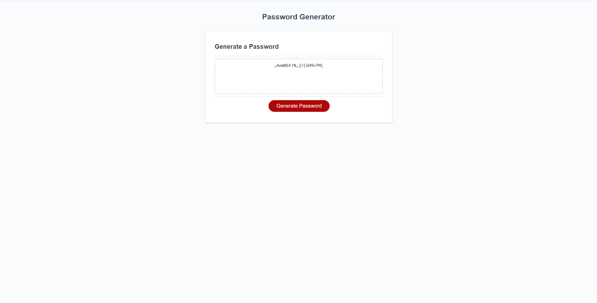

# Password-Generator

## Description

This application emphasizes the use of JavaScript to generate a random password with the appropriate selected criteria by the user.

It is a Project by a coding bootcamp to display the skills in writing JavaScript and meet certain conditions for user experience.
 

## Usage

Deployed application:  
https://biscuit231.github.io/Password-Generator/ 

## Credits

My Github:  
https://github.com/biscuit231/

Readme guide:  
https://coding-boot-camp.github.io/full-stack/github/professional-readme-guide

## License

MIT License
